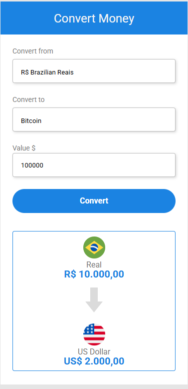

### **💱 Currency Converter**   
  
  


A simple and intuitive currency converter, developed as part of the **Dev Club** course. Convert **Brazilian Real (BRL) to US Dollar (USD) and Euro (EUR)** easily. 🚀  

## 🔧 **Technologies**  
- **HTML** – Structure  
- **CSS (SASS)** – Styling  
- **JavaScript** – Logic & DOM Manipulation  

## ⚡ **Features**  
- Convert **BRL to USD and EUR**  
- Auto-update conversion on currency change  

## 🚀 **How to Use**  
```bash
git clone https://github.com/CamilleGS/currency-convert.git  
cd currency-convert  
open index.html  
```  

## 📷 **Preview**  
  

## 🔄 **Future Improvements**  
- More currency options  
- Real-time exchange rates  

---

## **👨‍💻 Author**  
💡 **CamilleGS**  
📌 Project developed during the **Dev Club** course.  

🔗 Connect with me on [LinkedIn](www.linkedin.com/in/camille-gonsalves-de-souza-14ba25267)  

---
